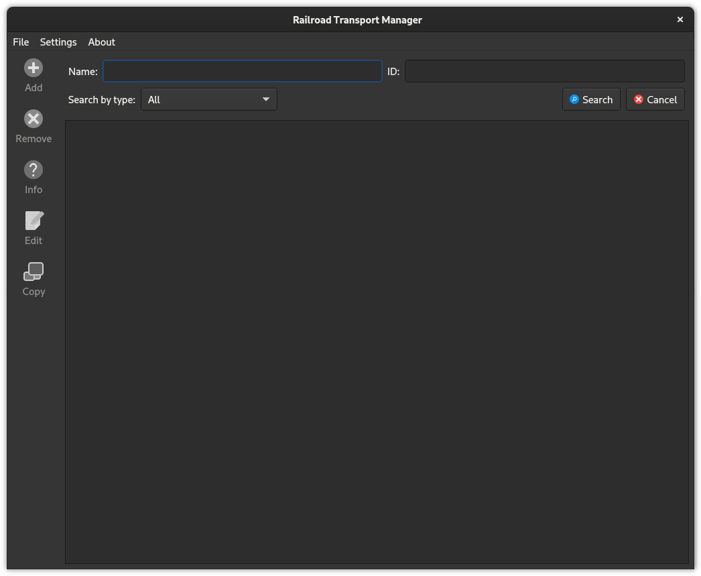
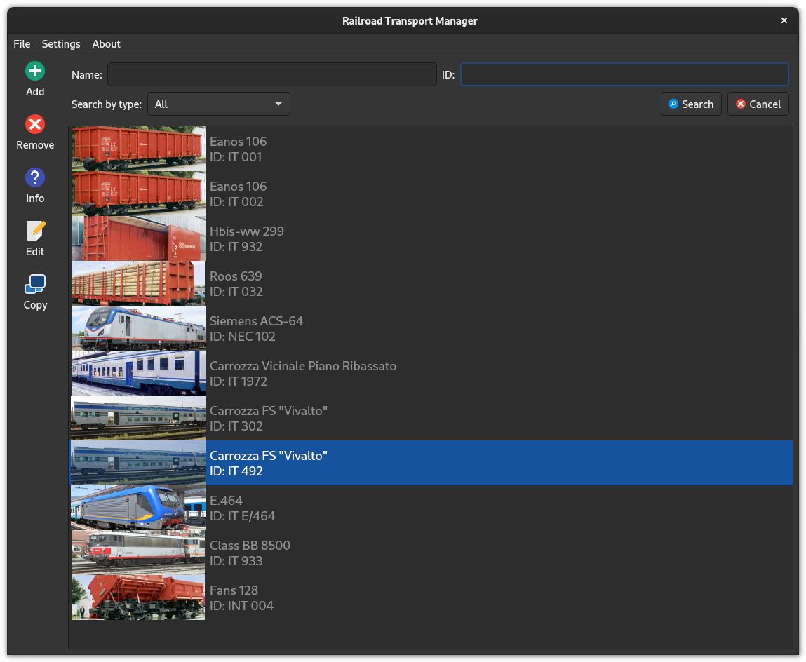
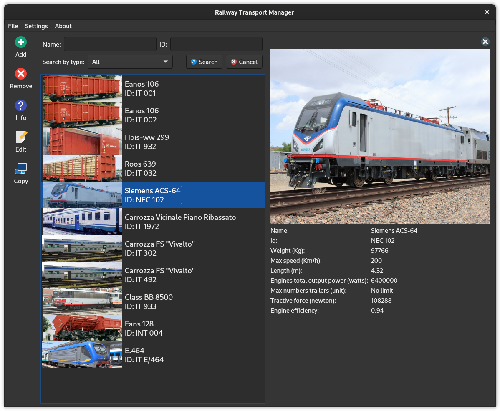
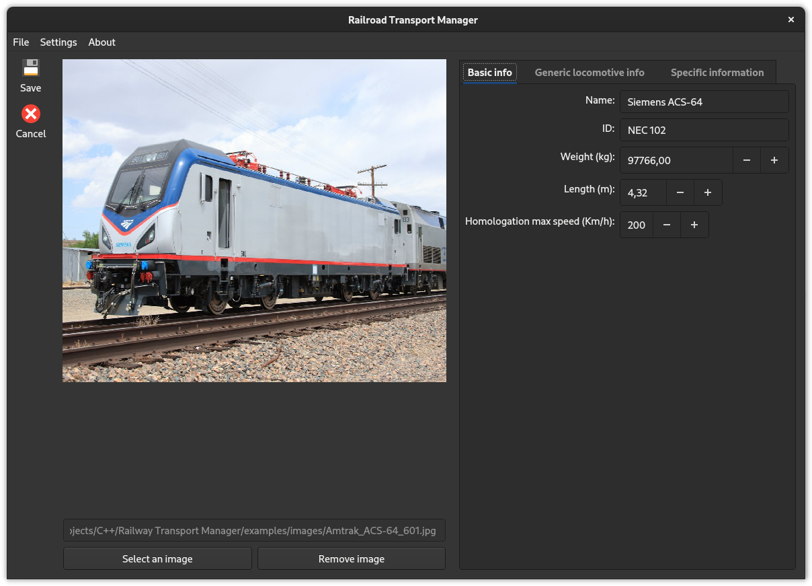
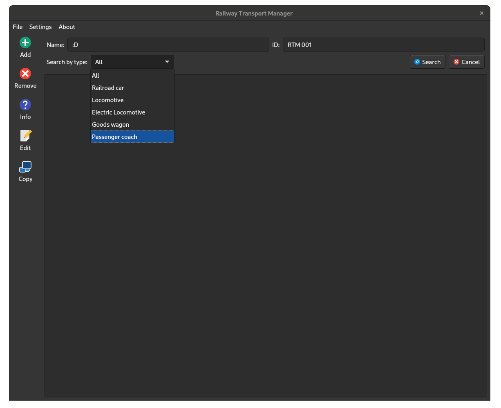
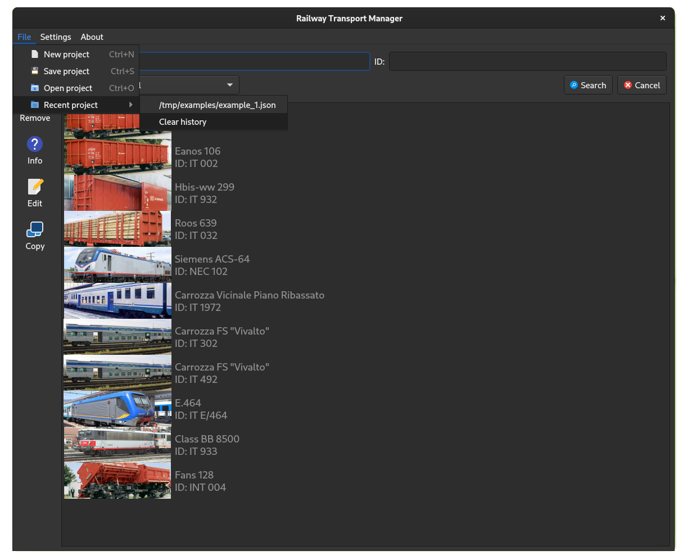

# ⚠️ Disclaimer (Importante) ⚠️
Il seguente progetto è stato pubblicato solo a scopo dimostrativo. **Non è acconsentito** copiare, in parte o del tutto, il codice del progetto e presentarlo come proprio, in particolare se si tratta di progetti universitari. **Non mi assumo** la responsabilità di come viene utilizzato questo software, tanto meno della correttezza delle informazioni presenti al suo interno. Per maggiori dettagli fare riferimento alla licenza.

# Railway Transport Manager (o RTM) 🚆

## Abstract

**RTM** (Railway Transport Manager) è un gestionale che consente di gestire i mezzi ferroviari, dove è permessa: la creazione, la modifica, l’eliminazione e la visualizzazione dei vari tipi di convogli. I mezzi ferroviari sono suddivisi in due categorie principali: trainabili e da trazione. La categoria dei trainabili comprende carri merci e vagoni passeggeri, mentre quella da trazione comprende le locomotive elettriche.

## Note
RTM è il progetto che ho sviluppato per la parte pratica dell'esame di Programmazione Ad Oggetti (PAO) presso l'università di Padova, per il corso di laurea in Informatica. Per maggiore dettagli "tecnici" leggi la [relazione](docs/Relazione/relazione.pdf), purtroppo non è veramente esaustiva a causa della limitazione delle 8 pagine richieste dalla specifica di progetto.

> Sì, lo so, sono pessimo a dare i nomi alle mie applicazioni.


## Screenshot

Interfaccia semplice e autoesplicativa. Colorata con tante icone variegate.



📂 Esempio di un progetto aperto nella vista *viewer* dove vengono mostrati tutti i mezzi.



ℹ️ Esempio della vista *info* per ottenere maggiori dettagli del mezzo.



✏️ Vista dell'editor con a destra una gestione a schede dei vari campi da compilare, in questo modo è possibile raggruppare le informazioni comuni per tutti i mezzi ferroviari da quelle specifiche per il mezzo al momento visualizzato.



🔍 Ricerca semplice dei mezzi. Altamente estensibile a livello di codice, perché ogni funzione di ricerca è una *lambda expression*, non è necessario dunque creare o ristrutturare una funzione di "search" per aggiungere/rimuovere nuovi metodo di ricerca, basta creare un funtore oppure una espressione lambda. λ


🇮🇹 Supporto per più lingue (nell'immagine è la versione in Italiano). Allo stato attuale ci sono 2 lingue: inglese (default) e italiano.



🕗 Cronologia dei progetti, per non dover cercare sempre li stessi file. 😀

## Alcune precisazioni
Purtroppo, a causa degli impegni universitari e del tempo stringente, il codice della finestra principale non mi piace molto (funziona, ma non è poco "elegante" e soprattutto può risultare difficile da leggere).

Le icone per il mio progetto le ho prese dal pacchetto di icone [papirus](https://github.com/PapirusDevelopmentTeam/papirus-icon-theme).

## Valutazione

```plain
Feedback Progetto di Programmazione ad Oggetti
Valutazione del progetto: lode
Voto finale dell'esame:

Vincoli obbligatori
+ Soddisfatti


Orientamento ad oggetti
+ Incapsulamento
+ Modularità (modello logico e la GUI sono separati)
+ Estensibilità ed evolvibilità, polimorfismo
+ Efficienza e robustezza


Funzionalità
+ Utilizzo adeguato di strumenti come il visitor
+ Numerose funzionalità descritte nella relazione, con particolare
  attenzione alla correttezza e gestione degli errori


GUI
+ Visualizza i diversi tipi di dato in maniera opportuna
+ Usabile e intuitiva
+ Robusta, gestisce ridimensionamento
+ Utilizza immagini, icone ed elementi grafici


Relazione
+ Adeguata


Suggerimenti non collegati alla valutazione
Nessuno.
```
