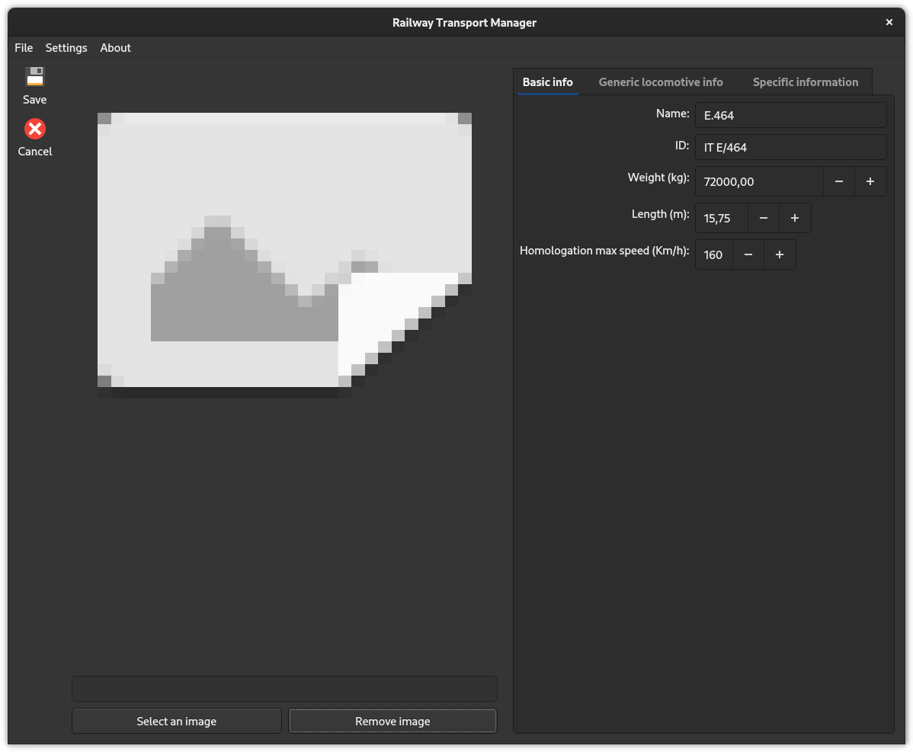

<!-- LTeX: language=it -->
# Railway Transport Manager (o RTM) 🚆

## Abstract

**RTM** (Railway Transport Manager) è un gestionale che consente di gestire i mezzi ferroviari, dove è permessa: la creazione, la modifica, l’eliminazione e la visualizzazione dei vari tipi di convogli. I mezzi ferroviari sono suddivisi in due categorie principali: trainabili e da trazione. La categoria dei trainabili comprende carri merci e vagoni passeggeri, mentre quella da trazione comprende le locomotive elettriche.

## Breve introduzione

RTM è il progetto che ho sviluppato per la parte pratica dell'esame di Programmazione Ad Oggetti (PAO) presso l'università di Padova, per il corso di laurea in Informatica. Per maggiore dettagli "tecnici" vedi la [relazione](docs/Relazione/relazione.pdf), purtroppo non è veramente esaustiva a causa della limitazione delle otto pagine richieste dalla specifica di progetto.

Per il progetto è stato utilizzato il framework Qt 6. 

## Compatibilità

Questo programma è compatibile (_in teoria_) solo con i sistemi operativi GNU\Linux. Il programma è stato testato (in ordine di rilevanza) su:

- Fedora Workstation 37

- Ubuntu 22.04 LTS

## Screenshot & funzionalità

✅ Interfaccia: semplice, autoesplicativa, colorata e dinamica.

📂 Esempio di un progetto aperto nella vista *viewer* dove vengono mostrati tutti i mezzi presenti nel catalogo.

ℹ️ Esempio della vista *info* per ottenere maggiori dettagli del mezzo.

✏️ Vista dell'editor con a destra un widget di schede con vari campi da compilare, in questo modo è possibile raggruppare/distingure le informazioni comuni per tutti i mezzi ferroviari da quelle specifiche per il veicolo al momento visualizzato.

🔍 Ricerca semplice dei mezzi. Altamente estensibile a livello di codice perché ogni funzione di ricerca è una *lambda expression*, non è necessario dunque creare o ristrutturare una funzione di "search" per aggiungere/rimuovere dei nuovi metodi di ricerca, ma basta creare un funtore oppure una espressione lambda. λ

🇮🇹 Supporto per più lingue (nell'immagine viene mostrata la versione in Italiano). Allo stato attuale ci sono 2 lingue: inglese (default) e italiano.

🕗 Cronologia dei progetti, per non dover cercare sempre li stessi file. 😀

## Crediti

Le icone le ho prese dal pacchetto [papirus](https://github.com/PapirusDevelopmentTeam/papirus-icon-theme).

## Valutazione
30L